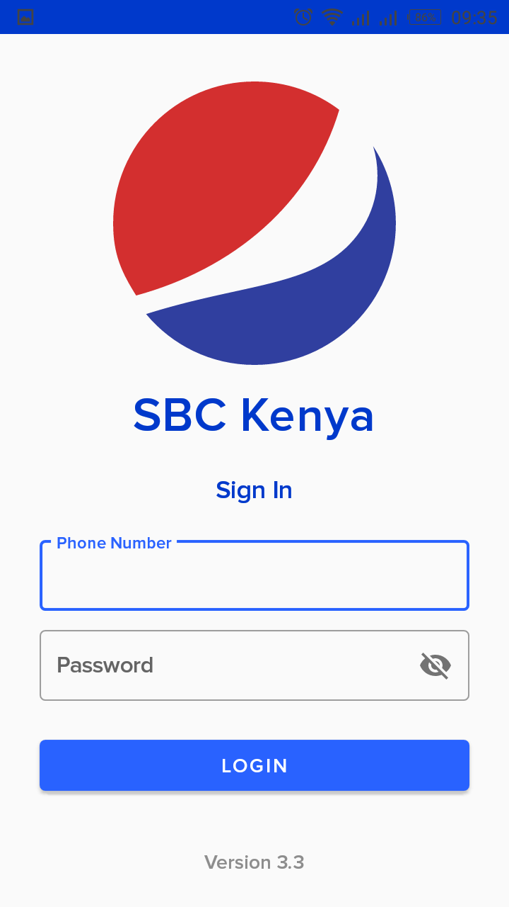

## SBC Logistics App.

SBC deals in production and distribution of beverages, and is the sole distributor for Pepsi in Kenya. They have salespeople countrywide who monitor the stock status in fridges countrywide. They previously used to send photos on Whatsapp groups, and there were Whatsapp groups for designated regions. For instance, salespeople in Nairobi West sent pictures of fridges from various retails outlets in Nairobi West that get beverages from SBC. 

But this was inefficient because they couldn't make use of the data from various outlets. Plus conversations on Whatsapp can be overwhelming, especially when everyone is sending photos at the same time. 
Yet, the group supervisor had to keep taking stock as photos came in from various outlets. It was also hard to keep track of the salespeople's location, or automatically register the number of outlets they'd visited in a day. Lack of such data consequently made it hard to track their perfomance over time.

## The Solution
The client needed a system to help fix these flaws. I created the android app with that in mind and came up with the following features:

  

- Integrated GPS to send the user location every fifteen minutes, to a backend(built by my wonderful colleagues @csdigital), which the client then uses as a web portal to monitor outlets and salespeople. I used workmanager + fused location provider to receive and schedule background location updates.

- Simple login, with telephone number and password. The user accounts are already preregistered in the web portal. Once the user logs in and accepts all required permissions(Location, storage, and camera), the workmanager starts transmitting their location.

  

### Register New Customer
When you click on Register New Outlet, a barcode scanner pops up. I should have mentioned that every outlet/fridge has a tamper-proof barcode, provided by the client. When you register a customer, you also assign a barcode to their outlet. You'll then scan this barcode everytime you visit to take a picture of the stock status in their fridges, so you can provide them with more beverages, and gauge the rate of consumption.

Moving on...
Once you click on register new customer, and scan the barcode, you then fill a form to capture the details of a new outlet, and take a picture of the 'shop' as shown below:
In this case I took a picture of a book for demonstration. When you press the submit button, the location cordinates of the new outlet are also transmitted in that instance.

  

### Track Execution Tracking
Track execution tracking works in a similar manner. Click button then scan barcode, but instead it fetches the details of an outlet that already exists. If the outlet is active, you can then take a picture of the fridge/stock status and upload it. This will then be assessed by the supervisor on the web portal. 

  

## Some of the Technologies Used
- This was built with Kotlin
- Fused location provider for location
- Retrofit for sending requests
- Android Architecture components - Room for DB, Repositories and DAOs, and Viewmodel.
- Workmanager for background tasks.
- Hours of debugging by yours truly
- Google's Material Design Guideline for UI design and Dribbble for inspiration
